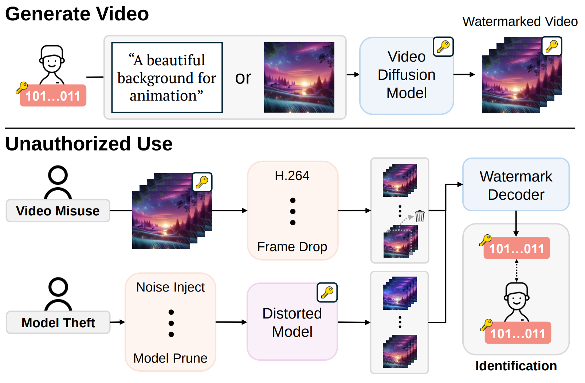

# LVMark: Robust Watermark for Latent Video Diffusion Models

## Overview

<div align="center">
  
</div>

Recent advancements in video diffusion models have enabled the generation of photorealistic videos, raising critical concerns about unauthorized use and model ownership. While existing watermarking methods have proven effective in image domains, they often fail in video scenarios due to a lack of temporal consistency, resulting in degraded visual quality and vulnerability to distortions. **LVMark** addresses this challenge by introducing a novel watermarking method specifically designed for video diffusion models. Our approach leverages temporal consistency across adjacent frames and embeds watermark bits into the **low-frequency components of the 3D wavelet domain** and **RGB features**. To preserve perceptual quality, we adopt an **importance-based weight modulation strategy**, embedding only in layers with minimal impact on appearance. We jointly optimize the watermark decoder and the latent decoder within the diffusion model, achieving a balance between **visual quality** and **bit accuracy**. Our experiments demonstrate that LVMark can embed **invisible, robust 512-bit watermarks** that remain detectable under various video distortions and attacks.

---

## Requirements

- Python ≥ 3.8  
- PyTorch == 2.4.1

Install dependencies:

```bash
pip3 install -r requirements.txt
````

---

## Dataset

The training dataset can be downloaded from the following link:
👉 [Panda-70M](https://github.com/snap-research/Panda-70M)

---

## H.264 Attack Simulation

To simulate real-world compression, we include a pretrained **H.264 distortion network** as part of our Attack Distortion Layer.
This module ensures watermark robustness against lossy encoding methods like H.264.

Checkpoint path:

```
attack_methods/diff_h264/checkpoints/model_weights_epoch_20.pth
```

---

## Code Usage

### Training and Evaluation

Use the following command to train and evaluate LVMark:

```bash
CUDA_VISIBLE_DEVICES=0 accelerate launch ./trainval_LVMark.py \
    --pretrained_model_name_or_path ./DynamiCrafter/checkpoints/dynamicrafter_512_v1/model.ckpt \
    --model_config ./DynamiCrafter/configs/inference_1024_v1.0.yaml \
    --center_crop \
    --dataloader_num_workers 8 \
    --train_batch_size 1 \
    --exp_name {exp name} \
    --train_dir {train dataset path} \
    --val_dir {valid dataset path} \
    --n_frames 8 \
    --resolution 256 \
    --train_steps_per_epoch 250 \
    --max_train_steps 15000 \
    --checkpointing_steps 250 \
    --phi_dimension 32 \
    --attack all \
    --output_dir output_1024 \
    --seed 2777 \
    --dim 2048 \
    --learning_rate 1e-4 \
    --lambda_w 0.8 \
    --lambda_lpips 0.7 \
    --lr_mult 1 \
    --affine_list_path ./layer_noise_0.5.txt \
    --lambda_patch_l1 10
```

---

### Inference (Watermark Embedding)

To generate watermarked videos:

```bash
cd ./DynamiCrafter/scripts
. ./inference_watermark.sh
```

---

### Metric Evaluation

To compute quantitative evaluation metrics:

```bash
cd ./DynamiCrafter/scripts/metric_using_video
. ./metrics_for_videos.sh
```

---

## Integration with Open-Sora

Watermark embedding can also be applied to [Open-Sora](https://github.com/hpcaitech/Open-Sora).
You can train Open-Sora using the provided files:

* `customization_sora.py`
* `layer_noise_0.5_sora.txt`

---

## Citation

If you find this work useful, please consider citing:

```bibtex
@article{jang2026lvmark,
  title={Lvmark: Robust watermark for latent video diffusion models},
  author={Jang, Youngdong and Jang, Minhyuk and Lee, JaeHyeok and Yang, Feng and Oh, Gyeongrok and Jeong, Jongheon and Kim, Sangpil},
  journal={IEEE Transactions on Information Forensics and Security},
  year={2026},
  publisher={IEEE}
}
```

